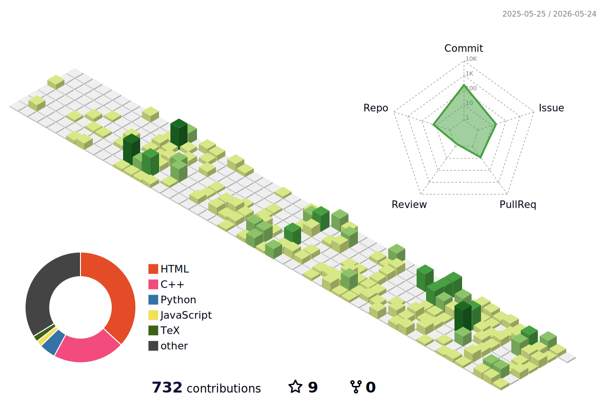

<a href="README.md">🇯🇵 日本語</a>

## About me
- University of Tsukuba
  - School of Science and Engineering Engineering Systems ( 2024/04 - )
- Qualifications
  - Third class amateur radio operator ( 2024/08 )
## activity
  - University of Tsukuba "Yui" Project ( 2024/04 - )
    - Undergraduate students lead the project to develop a nano-satellite (CubeSat).
      - A little over 50 people are active.
      - Currently developing a third machine, TSUKUTO.
      - Mainly engaged in software development of telecommunications equipment
    - post
      - Sub Chief, Communications ( 2025/06 - )
      - Chief, Public Relations and External Affairs Team ( 2025/04 - )
      - Student Representative ( 2024/11 - 2026/01 )
      - New Student Recruitment Team Chief ( 2024/12 - 2025/05 )
      - C&Dh system Members ( 2024/04 - 2025/06 )
  - Part-time tutoring ( 2024/12 - )
    - Taught physics and chemistry for high school seniors and mathematics for junior high school students
  - Chair of the Welcome Committee for New Students, School of Engineering and Systems ( 2024/09 - 2025/04 )
  - Tsukuba Robot Circle Hardware Group ( 2024/04 - 2025/03 )

## What we do.

## Various Links
- [GitHub](https://github.com/k42um/)
- [Twitter](https://x.com/k42uma)
- [Zenn](https://zenn.dev/k42uma)
- [Qiita](https://qiita.com/k42uma)

---
*This file was automatically generated by machine translation from [README.md](README.md).*
