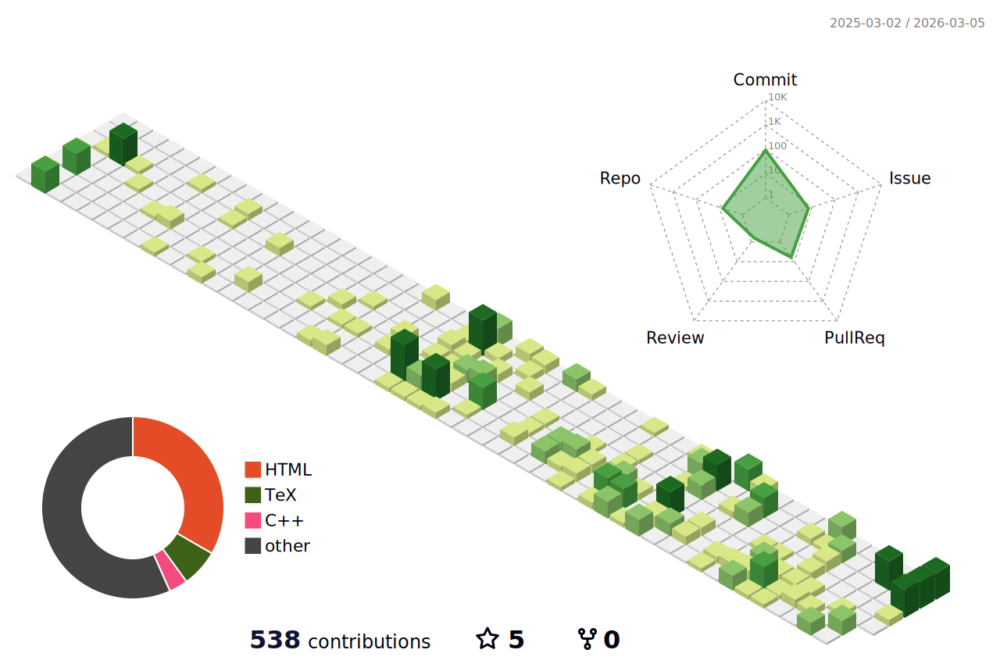

## About me
- 筑波大学
  - 理工学群工学システム学類 ( 2024/04 - )
- 資格
  - 第三級アマチュア無線技士 ( 2024/08 )
## 活動
  - 筑波大学「結」プロジェクト ( 2024/04 - )
    - 学部生が主体となって、超小型人工衛星（CubeSat）を開発するプロジェクト
      - 50名強が活動中
      - 現在は3号機となるTSUKUTOを開発中
      - 主に通信機のソフトウェア開発に従事
    - 役職
      - 通信系 サブチーフ ( 2025/06 - )
      - 広報・渉外チーム チーフ ( 2025/04 - )
      - 学生代表 ( 2024/11 - 2026/01 )
      - 新歓チーム チーフ ( 2024/12 - 2025/05 )
      - C&Dh系 メンバ ( 2024/04 - 2025/06 )
  - つくば市内の学習塾（ 2024/12 - ）
    - 高校3年生の物理・化学や中学生の数学を担当
  - 工学システム学類新入生歓迎委員会 委員長 ( 2024/09 - 2025/04 )
  - つくばろぼっとサークル ハード班 ( 2024/04 - 2025/03 )

## やってること

## 各種リンク
- [GitHub](https://github.com/k42um/)
- [Twitter](https://x.com/k42uma)
- [Zenn](https://zenn.dev/k42uma)
- [Qiita](https://qiita.com/k42uma)

